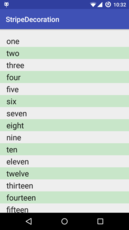
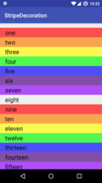
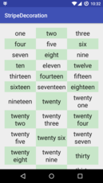

[](https://travis-ci.org/sanbeg/StripeDecoration)
[](https://codecov.io/gh/sanbeg/StripeDecoration)
[ ](https://bintray.com/steve-sanbeg/maven/stripe-decoration/_latestVersion)

StripeDecoration
================

Android library to decorate a RecyclerView with alternating stripes. You
would typically provide a single stripe, to alternate between striped and
plain rows, but can also provide arbitrary numbers of stripes for it to
iterate through.  It works with vertical, horizontal, and even grids.

## Quick Start

1. Add the dependency

```groovy
    dependencies {
        implementation 'com.github.sanbeg.StripeDecoration:stripe-decoration:1.1.0'
    }
```

2. Add a RecyclerView to your layout

```XML
<android.support.v7.widget.RecyclerView xmlns:android="http://schemas.android.com/apk/res/android"
    xmlns:app="http://schemas.android.com/apk/res-auto"
    android:id="@+id/list"
    android:layout_width="match_parent"
    android:layout_height="match_parent"
    android:paddingLeft="@dimen/activity_horizontal_margin"
    android:paddingRight="@dimen/activity_horizontal_margin"
    android:paddingTop="@dimen/activity_vertical_margin"
    android:paddingBottom="@dimen/activity_vertical_margin"
    android:clipToPadding="false"
    app:layoutManager="LinearLayoutManager"
    android:orientation="vertical" />
```

3. Create a StripeDecoration, and add it to your RecyclerView
```java
        RecyclerView recyclerView = (RecyclerView) findViewById(R.id.list);
        StripeDecoration decoration = new StripeDecoration(
                new PaintDrawable(ContextCompat.getColor(this, R.color.neutralStripe))
        );
        recyclerView.addItemDecoration(decoration);
```

## Sample images




